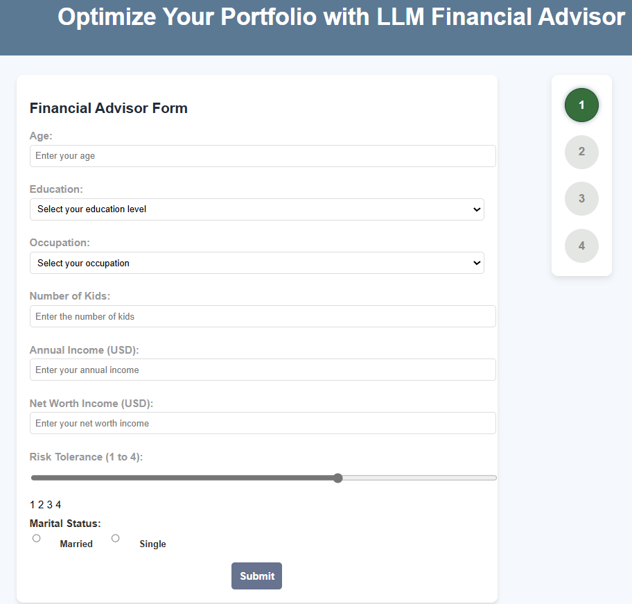
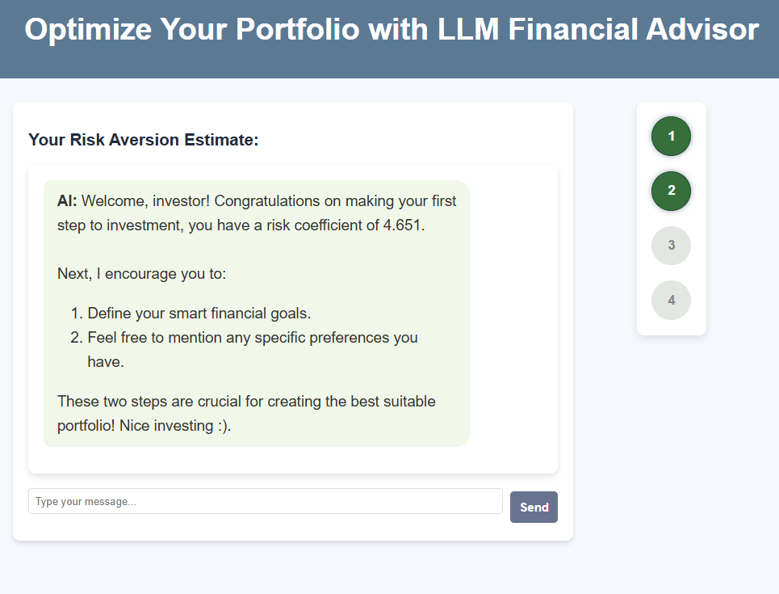
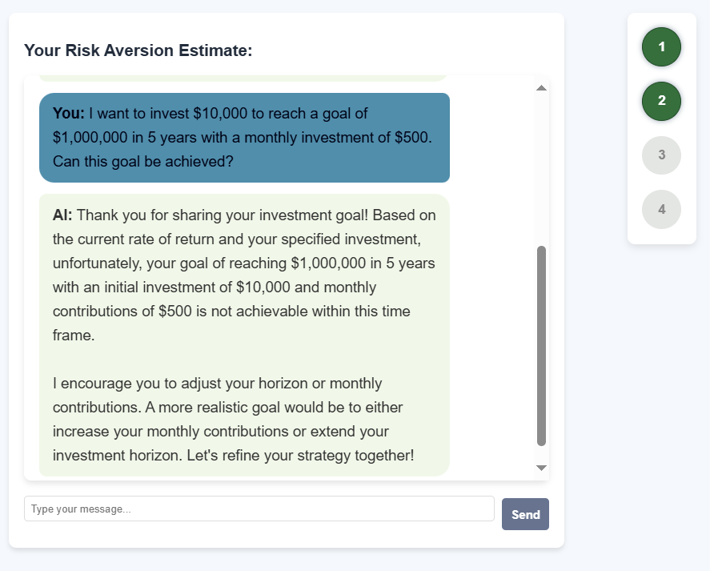
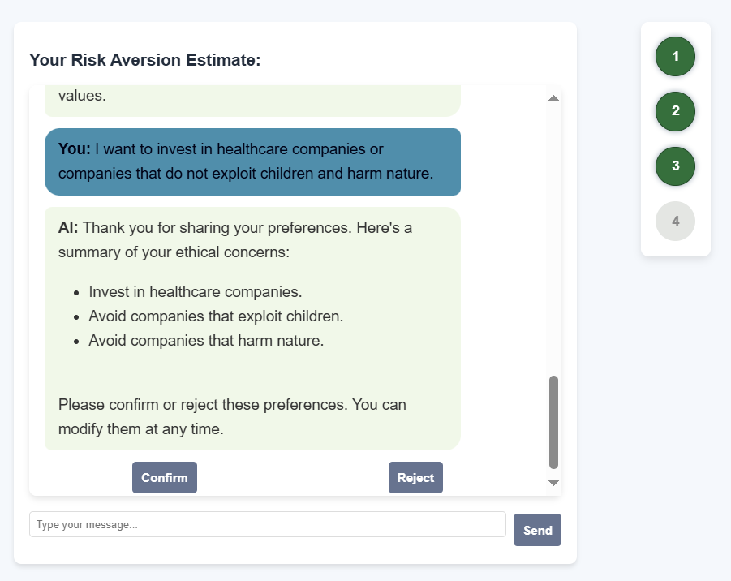

# Financial Advisor Application

## Overview

The Financial Advisor application is designed to assist investors in constructing optimal portfolios based on their preferences, market trends, and asset analysis. The application leverages AI and machine learning to provide personalized investment advice. Below is a detailed guide on how the application works and the steps involved in creating a tailored investment portfolio.

## Key Features

1. **Customer Profiling**: The AI agent interacts with users to gather essential information and understand their investment preferences.
2. **Risk Aversion Estimation**: A machine learning model estimates the user's risk aversion coefficient based on the collected data.
3. **Asset Selection**: The AI selects suitable assets from a database using natural language prompts.
4. **Real-Time Data Processing**: A data collection microservice ensures the database is updated with real-time financial data.
5. **Portfolio Optimization**: The chosen assets and user information are sent to a portfolio optimization microservice to generate an optimal portfolio.
6. **Detailed Reports and Visualizations**: The application provides detailed reports and visualizations to help users understand the investment choices.

## Data Processing Pipeline

1. **Data Collection**: A microservice collects real-time financial data from various sources.
2. **Feature Selection**: The system ensures only new data is processed by the feature selection engine.
3. **Metrics Computation**: Important metrics are computed, and data validation checks are performed.
4. **Gold Layer**: The final processed data is stored in the gold layer for use in portfolio optimization.

## Step-by-Step Guide

### Step 1: Customer Profiling

The first step involves gathering essential information from the user to create a customer profile. This includes:

- **Age**
- **Education Level**
- **Occupation**
- **Number of Kids**
- **Annual Income**
- **Net Worth**
- **Risk Tolerance (1 to 4)**
- **Marital Status**

### Step 2: Risk Aversion Estimation

Based on the customer profile, the AI agent estimates the user's risk aversion coefficient. This coefficient is crucial for determining the appropriate investment strategy.

### Step 3: Defining Financial Goals

Users are encouraged to define their financial goals and specify any preferences they have. This step is crucial for creating a portfolio that aligns with the user's objectives.

### Step 4: Ethical Preferences

Users can specify ethical preferences for their investments, such as investing in healthcare companies or avoiding companies that exploit children or harm nature.

### Step 5: Portfolio Optimization

The AI agent uses the collected data to select suitable assets from the database. The portfolio optimization microservice then generates an optimal portfolio based on the user's risk aversion coefficient and preferences.

### Step 6: Detailed Reports and Visualizations

The application provides detailed reports and visualizations to help users understand the investment choices and the rationale behind them.

